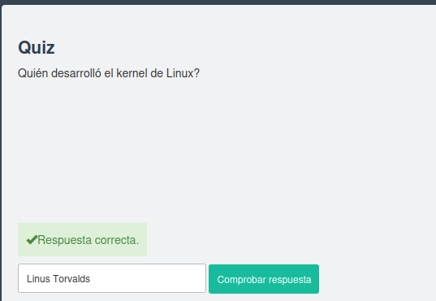
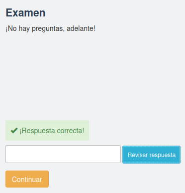
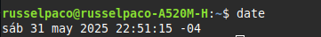

# LINUX JOURNEY
# GRASSHOPPER
## Getting Started
### 1. *History*

### 2. *Choosing a Linux Distribution*

### 3. Debian

### 4. Red Hat Enterprise Linux

### 5.Ubuntu

### 6.Fedora

### 7.Linux Mint

### 8.Gentoo

### 9.Arco Linux

### 10.Ab openSUSE

## Command Line
### 1. *The Shell*
> La shell es un programa que toma sus comandos del teclado y los envia al sistema operativo para realizar.
### Exercises
>$date, $whoami

### QUIZ

### 2. pwd (Print Working Directory)
> Todo en linux es un archivo. Cada archivo se organiza en un arbol de directorios jeràrquicos. El primer directorio es llamado el directorio raiz. Para ver donde se encuentra se debe utilizar el comando pwd.
### QUIZ

### 3. cd(Change Directory)
> El cd o directorio de cambio nos ayudara a movernos entre directorios, se tiene dos maneras diferentes de especificar un camino o ruta, con rutas absolutas o relativas.
### Exercises 
> ¿si solamente se usa el comando "cd" sin banderas que sucede?

### QUIZ

### 4. ls (List Directories)
> El comando ls sirve para listar contenidos de directorios. El comando ls listará directorios y archivos en el directorio actual por defecto, sin embargo, puede especificar de que ruta desea listar sus directorios
### Exercises
> Se pide ejecutar ls con diferentes banderas: ls -r, -R, -t

### QUIZ

### 5. touch
> El comando touch nos permite crear nuevos archivos vacios 
### Exercises
> Se pide crear un archivo, averiguar la fecha y luego actualizar al fecha

### QUIZ

### 6. file
> En Linux los nombres del archivo no estan obligados a representar el contenido del archivo. Se podria tener un archivo llamado sistemas.gif que en realidad no es un GIF. Para averiguar el tipo del archivo se utiliza el comando file 
### Exercises
> Ejecute el comando file en unos directorios y archivos

### QUIZ

### 7. cat
> Con el comando cat podemos ver el contenido del archivo, asi tambien, se puede combinar varios archivos y mostrar la salida de ellos 
### Exercises
> Ejecutar el coando cat en diferentes archivos y directorios

### QUIZ

### 8. less
>  Con el comando less el texto de un archivo se muestra de una manera pagina, por lo que se puede navegar en ella
### Exercises
>ejecute el comando less en un archivo

### QUIZ

### 9. History
> Con las flechas de arriba y abajo podemos navegar en el historial de los comandos que ejecutamos, asi tambien un atajo al historial es presionar ctrl-R y empezamos a escribir partes del comando que quieres volver a ejecutar sin necesidad de escribirlo todo de nuevo, con el comando clear limpiamos la terminal, si comenzamos a escribir el principio de un comando y presionamos Tab se autocompletara en funcion de lo que se encuentra en el directorio siempre y cuando no se tenga otros archivos que comiencen con esas letras
### Exercises
>navegue por su istorial usando las techas UP y Down, utilice la tecla ctrl-R

### QUIZ

### 10. cp(Copy)
> Con el comando cp copiaremso archivos de un destino a otro 
### Exercises
>Copiar algunos archivos

### QUIZ

### 11. mv (Move)
> El comando mv utilizado para mover archivos y tambien cambiar el nombre 
### Exercises
>Nombrar un archivo y luego moverlo

### QUIZ

### 12. mkdir (Make Directory)
> El comando mkdir sirve para crear directorios si no existen
### Exercises
>Haz un par de directorios y mueve algunos archivos a ese directorio 

### QUIZ

### 13. rm(Remove)
>El comando rm funciona para eliminar archivos y directorios 
### Exercises
> Crear un archivo -file y luego remueva ese archivo

### QUIZ

### 14. find
>con este comando buscaremos archivos o directorios
### Exercises
>Encuentre un archivo que tenga la palabra red

### QUIZ

### 15. help
> Linux tiene herramientas integradas para ayudar a utilizar un comando o saber que banderas tiene 
### Exercises
>Ejecute el comando help para echo, logout, pwd

### QUIZ

### 16. man
>con el comando man se puede ver el manual de cualquier comando 
### Exercises
> Ejecute el comando man con ls

### QUIZ

### 17. whatis
>El comando whatis proporciona una breve descripcion de cualquier comando
### Exercises
>Utilice el comando whatis en less

### QUIZ

### 18. alias
>Si se necesita escribir un comando largo se puede asignar un alias a este comando para evitar escribirlo completo y escribir el alias solamente
### Exercises
>Cree un alias y luego eliminelo 

### QUIZ

### 19. exit
>El comando exit sirve para salir del shell
### QUIZ

## Text-Fu
### 1. stdout (Standard Out)

### 2.stdin (Standard In)

### 3. Sderr (Standard Error)

### 4. pipe and tee

### 5. env (Environment)

### 6. cut

### 7. paste

### 8. head

### 9. tail

### 10. expand and unexpand

### 11. join and split

### 12. sort

### 13. tr (Translate)

### 14. uniq (Unique)

### 15. wc and nl

### 16. grep

## Advanced Text-Fu
### 1. regex (Regular Expressions)

### 2. Text Editors

### 3. Vim (Vi Improved)

### 4. Vim Search Patterns

### 5. Vim Navigation

### 6. Vim Appending Text

### 7. Vim Editing

### 8. Vim Saving and Exiting

### 9. Emacs

### 10. Emacs Manipulate Files

### 11. Emacs Buffer Navigation

### 12. Emacs Editing

### 13. Emacs Exiting and Help

## User Management
### 1. Users and Groups

### 2. root

### 3. /etc/passwd

### 4. /etc/shadow

### 5. /etc/group

### 6. User Management Tools

## Permissions 
### 1. File Permissions

### 2. Modifying Permissions

### 3. Ownership Permissions

### 4. Umask

### 5. Setuid

### 6. Setgid

### 7. Process Permissions

### 8. The Sticky Bit

## Processes
### 1. ps (Processes)

### 2. Controlling Terminal 

### 3. Process Details

### 4. Process Creation

### 5. Process Termination

### 6. Signals

### 7. kill (Terminate)

### 8. niceness

### 9. Process States

### 10. /proc filesystem

### 11. Job Control

## Packages
### 1. Software Distribution

### 2. Package Repositories

### 3. tar and gzip

### 4. Package Dependencies

### 5. rpm and dpkg

### 6. yum and apt

### 7. Compile Source Code

# JOURNEYMAN
## Devices
### 1. /dev directory

### 2. device types

### 3. Device Names

### 4. sysfs

### 5. udev

### 6. Isusb, Ispci, Issci

### 7. dd

## The Filesystem
### 1. Filesystem Types

### 2. Filesystem Types

### 3. Anatomy of a Disk

### 4. Disk Partitioning

### 5. Creating Filesystems

### 6. mount and umount

### 7. /etc/fstab

### 8. swap

### 9. Disk Usage

### 10. Filesystem Repair

### 11. Inodes

### 12. symlinks

## Boot the System
### 1. Boot Process Overview

### 2. Boot Process:BIOS

### 3. Boot Process:Bootloader

### 4. Boot Process:Kernel

### 5. Boot Process:Int

## Kernel
### 1. Overview of the Kerne

### 2. Privilege Levels

### 3. System Calls

### 4. Kernel Installation

### 5. Kernel Location 

### 6. Kernel Modules

## Init
### 1. System V Overview

### 2. System V Service

### 3. Upstart Overview

### 4. Upstart Jobs

### 5. Systemd Overvieww

### 6. Systemd Goals

### 7. Power States

## Process Utilization
### 1. Tracking processes:top

### 2. Isof and fuser 

### 3. Process Threads

### 4. CPU Monitoring

### 5. I/O Monitoring 

### 6. Memory Monitoring

### 7. Continuous Monitoring

### 8. Cron Jobs

## Process Utilization 
### 1. Tracking processes: top

### 2. Isof and fuser

### 3. Process Threads

### 4. CPU Monitoring

### 5. I/O Monitoring

### 6. Memory Monitoring

### 7. Continuous Monitoring

### 8. Cron Jobs

## Logging
### 1. System Logging

### 2. syslog

### 3. General Logging

### 4. Kernel Logging

### 5. Authentication Logging

### 6. Managing Log Files

# Networking Nomad
## Network Sharing
### 1. File Sharing Overview

### 2. rsync

### 3. Simple HTTP Server 

### 4. NFS

### 5. Samba

## Network Basics
### 1. Network Basics

### 2. OSI Model

### 3. TCP/IP Model

### 4. Network Addressing

### 5. Aplication Layer

### 6. Transport Layer

### 7. Network Layer

### 8. Link Layer

### 9. DHCP Overview

## Subnetting
### 1. IPv4

### 2. Subnets

### 3. Subnet Math

### 4. Subnetting Cheats

### 5. CIDR

### 6. NAT

### 7. IPv6

## Routing
### 1. What is a router?

### 2. Routing Table

### 3. Path of a Packet

### 4. Routing Protocols

### 5. Distance Vector Protocols

### 6. Link State Protocols

### 7. Border Gateway Protocol

## Network Config
### 1. Network Interfaces

### 2. route

### 3. dhclient

### 4. Network Manager

### 5. arp

## Troubleshooting
### 1. ICMP

### 2. ping

### 3. traceroute

### 4. netstat

### 5. Packet Analisis

## DNS
### 1. What is DNS?

### 2. DNS Components

### 3. DNS Process

### 4. /etc/host

### 5. DNS Setup

### 6. DNS Tools
